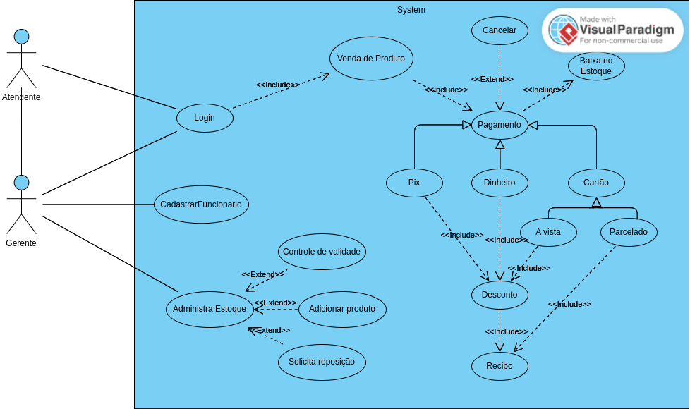

# Supermercado - Diagrama de Casos de Uso e Requisitos

## Índice
- [Diagrama de Casos de Uso](#diagrama-de-casos-de-uso)
- [Requisitos Associados](#requisitos-associados)
  - [UC01: Cadastro de Cliente](#uc01-cadastro-de-cliente)
  - [UC02: Login do Cliente](#uc02-login-do-cliente)
  - [UC03: Consulta de Produtos](#uc03-consulta-de-produtos)
  - [UC04: Adicionar Produtos ao Carrinho](#uc04-adicionar-produtos-ao-carrinho)
  - [UC05: Finalizar Compra](#uc05-finalizar-compra)
  - [UC06: Processamento de Pagamento](#uc06-processamento-de-pagamento)
  - [UC07: Emissão de Nota Fiscal](#uc07-emissão-de-nota-fiscal)
  - [UC08: Gestão de Estoque](#uc08-gestão-de-estoque)

---

## Diagrama de Casos de Uso

_O diagrama acima representa os principais casos de uso para um sistema de gerenciamento de supermercado._

---

## Requisitos Associados

### UC01: Cadastro de Cliente

- **Descrição:** Permitir que novos clientes se cadastrem no sistema.
- **Atores:** Cliente
- **Pré-condições:** O cliente não deve estar previamente cadastrado.
- **Pós-condições:** O cliente é registrado no sistema e pode realizar login.
- **Fluxo Principal:**
  1. O cliente acessa a página de cadastro.
  2. O cliente insere nome, e-mail, senha e endereço.
  3. O sistema valida os dados e verifica se o e-mail já está cadastrado.
  4. O sistema cria a conta do cliente e envia um e-mail de confirmação.
- **Fluxos Alternativos:**
  - **3a.** Se o e-mail já estiver em uso, o sistema exibe uma mensagem de erro e retorna ao passo 2.

### UC02: Login do Cliente

- **Descrição:** Permitir que clientes façam login para acessar suas contas.
- **Atores:** Cliente
- **Pré-condições:** O cliente deve estar previamente cadastrado.
- **Pós-condições:** O cliente é autenticado e redirecionado para a página inicial.
- **Fluxo Principal:**
  1. O cliente acessa a página de login.
  2. O cliente insere e-mail e senha.
  3. O sistema valida as credenciais.
  4. O cliente é redirecionado para a página inicial com acesso aos recursos do sistema.
- **Fluxos Alternativos:**
  - **3a.** Se as credenciais forem inválidas, o sistema exibe uma mensagem de erro e retorna ao passo 2.

### UC03: Consulta de Produtos

- **Descrição:** Permitir que clientes consultem a lista de produtos disponíveis no supermercado.
- **Atores:** Cliente
- **Pré-condições:** O cliente deve estar logado no sistema.
- **Pós-condições:** O cliente visualiza os produtos disponíveis e pode adicionar produtos ao carrinho.
- **Fluxo Principal:**
  1. O cliente acessa a página de consulta de produtos.
  2. O cliente filtra produtos por categoria, preço ou nome.
  3. O sistema exibe a lista de produtos filtrados.
  4. O cliente pode visualizar detalhes dos produtos.
- **Fluxos Alternativos:**
  - **2a.** Se não houver produtos disponíveis na categoria filtrada, o sistema exibe uma mensagem informando a indisponibilidade.

### UC04: Adicionar Produtos ao Carrinho

- **Descrição:** Permitir que clientes adicionem produtos ao carrinho de compras.
- **Atores:** Cliente
- **Pré-condições:** O cliente deve estar logado e ter consultado produtos.
- **Pós-condições:** O produto é adicionado ao carrinho e o cliente pode prosseguir com a compra ou continuar comprando.
- **Fluxo Principal:**
  1. O cliente seleciona um produto na lista de produtos.
  2. O cliente escolhe a quantidade desejada.
  3. O sistema verifica a disponibilidade em estoque.
  4. O produto é adicionado ao carrinho do cliente.
  5. O cliente pode visualizar o carrinho ou continuar comprando.
- **Fluxos Alternativos:**
  - **3a.** Se o produto não estiver disponível em quantidade suficiente, o sistema exibe uma mensagem de aviso e retorna ao passo 2.

### UC05: Finalizar Compra

- **Descrição:** Permitir que clientes finalizem suas compras.
- **Atores:** Cliente
- **Pré-condições:** O cliente deve ter produtos no carrinho.
- **Pós-condições:** A compra é registrada no sistema e o cliente é redirecionado para o pagamento.
- **Fluxo Principal:**
  1. O cliente acessa a página de carrinho.
  2. O cliente revisa os itens no carrinho.
  3. O cliente escolhe o método de entrega (entrega a domicílio ou retirada na loja).
  4. O cliente confirma os itens e escolhe a forma de pagamento.
  5. O sistema registra a compra e redireciona o cliente para a página de pagamento.
- **Fluxos Alternativos:**
  - **3a.** Se o cliente optar por retirar na loja, o sistema exibe as lojas disponíveis para retirada.

### UC06: Processamento de Pagamento

- **Descrição:** Processar o pagamento da compra realizada pelo cliente.
- **Atores:** Cliente, Sistema de Pagamento (externo)
- **Pré-condições:** O cliente deve ter finalizado a compra.
- **Pós-condições:** O pagamento é processado e confirmado.
- **Fluxo Principal:**
  1. O cliente escolhe o método de pagamento (cartão de crédito, débito ou boleto).
  2. O sistema direciona o cliente para a página de pagamento seguro.
  3. O cliente insere as informações de pagamento.
  4. O sistema de pagamento processa a transação.
  5. O sistema confirma o pagamento e atualiza o status da compra para "Pago".
- **Fluxos Alternativos:**
  - **4a.** Se a transação for recusada, o sistema exibe uma mensagem de erro e retorna ao passo 1.

### UC07: Emissão de Nota Fiscal

- **Descrição:** Emitir nota fiscal para a compra realizada pelo cliente.
- **Atores:** Sistema
- **Pré-condições:** O pagamento da compra deve estar confirmado.
- **Pós-condições:** A nota fiscal é gerada e enviada ao cliente por e-mail.
- **Fluxo Principal:**
  1. O sistema verifica o status do pagamento.
  2. O sistema gera a nota fiscal com base nos itens comprados.
  3. A nota fiscal é enviada para o e-mail do cliente.
- **Fluxos Alternativos:**
  - **2a.** Se houver erro na geração da nota fiscal, o sistema notifica o suporte técnico para intervenção manual.

### UC08: Gestão de Estoque

- **Descrição:** Permitir que administradores gerenciem o estoque de produtos do supermercado.
- **Atores:** Administrador
- **Pré-condições:** O administrador deve estar logado no sistema.
- **Pós-condições:** O estoque é atualizado conforme as operações realizadas.
- **Fluxo Principal:**
  1. O administrador acessa a página de gestão de estoque.
  2. O administrador visualiza a lista de produtos e suas quantidades em estoque.
  3. O administrador pode adicionar, remover ou ajustar quantidades de produtos.
  4. O sistema atualiza o estoque com as alterações realizadas.
- **Fluxos Alternativos:**
  - **3a.** Se o administrador tentar remover um produto que está no carrinho de um cliente, o sistema notifica sobre a impossibilidade de remoção.

---